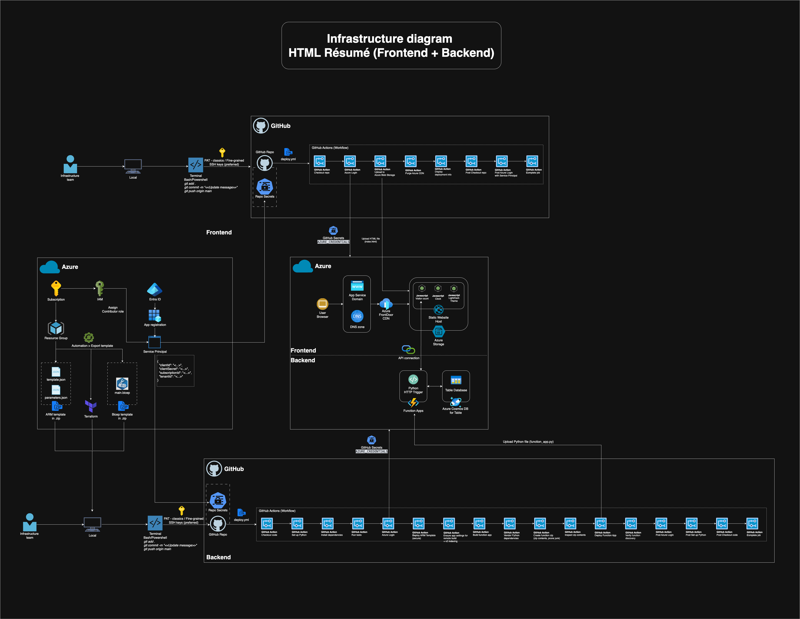

# 📝 Savio Ng – Interactive HTML Résumé (Frontend)

A single-page résumé (CV) published as a **static website** on Azure Storage and delivered globally via **Azure Front Door CDN**.  
Updates are deployed automatically from GitHub Actions.

| Live site | Tech stack | Deployment |
|-----------|------------|------------|
| **https://mycv.saviong.com** | HTML, CSS, Vanilla JS | Azure Static Website + CDN |

Please refer to https://github.com/saviong/html-resume-backend for the **Backend part** of the Interactive HTML Résumé.

---

## ✨ Feature Overview
| Feature | Description |
|---------|-------------|
| **Dark / Light theme** | Auto-detects system preference, manual toggle with ☀️/🌙 button, preference stored in `localStorage`. |
| **Live UK clock** | JavaScript renders London time (`Europe/London`) and updates every second. |
| **Visitor counter** | Calls serverless API (`updateCounter`) to increment & display total visits. |
| **Responsive design** | Pure CSS (Flexbox) — mobile-first, scales to desktop. |
| **Accessibility** | High-contrast colours, keyboard-navigable links, semantic headings. |
| **No frameworks** | Just HTML, CSS variables, and vanilla JS - easy to read & fork. |

---

## 🚀 Infrastructure diagram 

  

