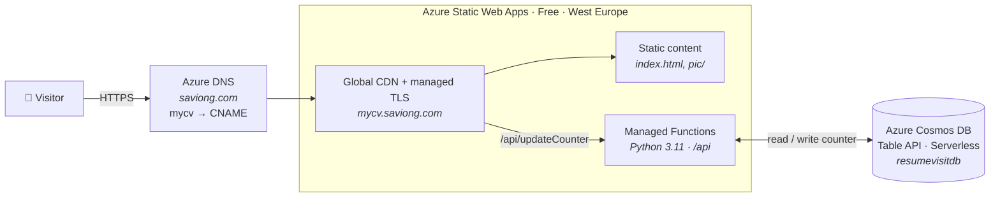
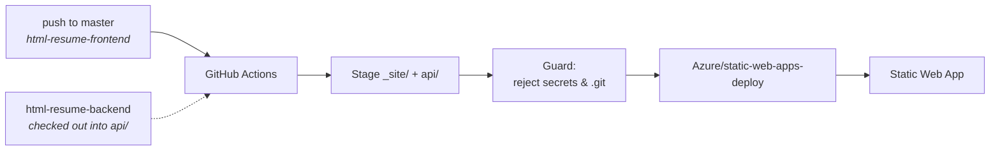

# 📝 Savio Ng – Interactive HTML Résumé (Frontend)

A single-page résumé (CV) hosted on **Azure Static Web Apps**, with a Python serverless
API for the visitor counter. Deployed automatically from GitHub Actions.

| Live site | Tech stack | Hosting |
|-----------|------------|---------|
| [**https://mycv.saviong.com**](https://mycv.saviong.com) | HTML, CSS, Vanilla JS | Azure Static Web Apps (Free plan) |

The API source lives in <https://github.com/saviong/html-resume-backend> and is deployed
from *this* repo's workflow — see [Deployment](#-deployment).

---

## 🏛️ Architecture

```mermaid
flowchart LR
    V["👤 Visitor"]
    DNS["Azure DNS<br/><i>saviong.com</i><br/>mycv → CNAME"]

    subgraph SWA["Azure Static Web Apps · Free · West Europe"]
        CDN["Global CDN + managed TLS<br/><i>mycv.saviong.com</i>"]
        STATIC["Static content<br/><i>index.html, pic/</i>"]
        API["Managed Functions<br/><i>Python 3.11 · /api</i>"]
    end

    COSMOS[("Azure Cosmos DB<br/>Table API · Serverless<br/><i>resumevisitdb</i>")]

    V -->|HTTPS| DNS --> CDN
    CDN --> STATIC
    CDN -->|"/api/updateCounter"| API
    API <-->|"read / write counter"| COSMOS
```

Everything the browser needs is same-origin: the page and `/api` are served from the same
hostname, so there are no CORS preflights and no separate API domain to manage.

### Deployment flow

```mermaid
flowchart LR
    A["push to master<br/><i>html-resume-frontend</i>"] --> B["GitHub Actions"]
    C["html-resume-backend<br/><i>checked out into api/</i>"] -.-> B
    B --> D["Stage _site/ + api/"]
    D --> E["Guard:<br/>reject secrets & .git"]
    E --> F["Azure/static-web-apps-deploy"]
    F --> G["Static Web App"]
```

---

## ✨ Feature Overview

| Feature | Description |
|---------|-------------|
| **Dark / Light theme** | Auto-detects system preference; manual ☀️/🌙 toggle, choice persisted in `localStorage`. |
| **Live clock** | Renders UK time via `Intl.DateTimeFormat`, updating every second, with the correct GMT/BST label. |
| **Visitor counter** | Calls `/api/updateCounter`; counts each IP at most once per hour. |
| **Dynamic tenure** | Current-role duration computed from the start date, accurate to the day. |
| **Responsive design** | Pure CSS (Flexbox) — mobile-first, scales to desktop. |
| **Accessibility panel** | Font sizing, high contrast, reduced motion (honours `prefers-reduced-motion`), enhanced focus rings. |
| **Print / PDF** | Print stylesheet; the accessibility panel is hidden from output. |
| **No frameworks** | Just HTML, CSS variables, and vanilla JS — easy to read & fork. |

---

## 🚀 Deployment

`.github/workflows/deploy-swa.yml` runs on push to `master`:

1. Checks out this repo and `html-resume-backend` (into `api/`), both with
   `persist-credentials: false` so no token is ever written to disk.
2. Stages **only** `index.html`, `staticwebapp.config.json` and `pic/` into `_site/`,
   and only the three files the Functions host needs into `api/`.
3. Runs a guard that fails the build if anything sensitive (a `.git` directory,
   `local.settings.json`, or a credential-shaped string) reached the staged output.
4. Deploys with `Azure/static-web-apps-deploy`. Oryx installs `api/requirements.txt`
   during the deploy.

A backend-only change does not trigger this workflow — run it manually from
**Actions → Deploy to Azure Static Web Apps → Run workflow** after merging there.

### Required secret

| Secret | Purpose |
|--------|---------|
| `AZURE_STATIC_WEB_APPS_API_TOKEN` | Static Web Apps deployment token |

### Runtime configuration

Set on the Static Web App (**Configuration → Application settings**), not in this repo:

| Setting | Purpose |
|---------|---------|
| `COSMOS_CONNECTION_STRING` | Cosmos DB Table API connection string |
| `TABLE_NAME` | Table holding the counter (currently `VisitCounter`) |

`staticwebapp.config.json` pins the API runtime to `python:3.11` and sets the security
headers (HSTS, `X-Content-Type-Options`, `Referrer-Policy`).

---

## 🔧 Recent Updates

**September 2026 — moved to Azure Static Web Apps:**
* Replaced Blob Storage static hosting. Storage cannot serve HTTPS on a custom domain
  without a CDN in front, and the Front Door that used to do this had been removed, so
  `mycv.saviong.com` was failing TLS. Static Web Apps provides a free managed,
  auto-renewing certificate.
* The API moved from a standalone Function App to managed functions on `/api`,
  same-origin with the page. The old Function App, its App Service plan and both
  storage accounts were decommissioned.
* **Security:** the previous workflow uploaded the entire repo — `.git/` included — to
  the public `$web` container, publishing a live Actions `GITHUB_TOKEN` on every deploy.
  Deploys now stage an explicit allow-list, checkouts use `persist-credentials: false`,
  and a guard step blocks sensitive paths.
* Fixed the tenure calculation (ignored day-of-month, so it read a month high), the
  clock's hardcoded `GMT` label, and theme persistence. Removed a dead inline-edit script.

**August 2025:**
* **System Clock Update:** Modified the live clock feature to use the user's local system time instead of fetching from an external API. This change improves reliability and removes an external dependency.
* **Content Update:** Refreshed the company icon for Anthony Nolan to ensure it displays correctly.
* **Margin Update:** Updated margin setting including `padding`, `margin-bottom`, `line-height` for better printing layout.
