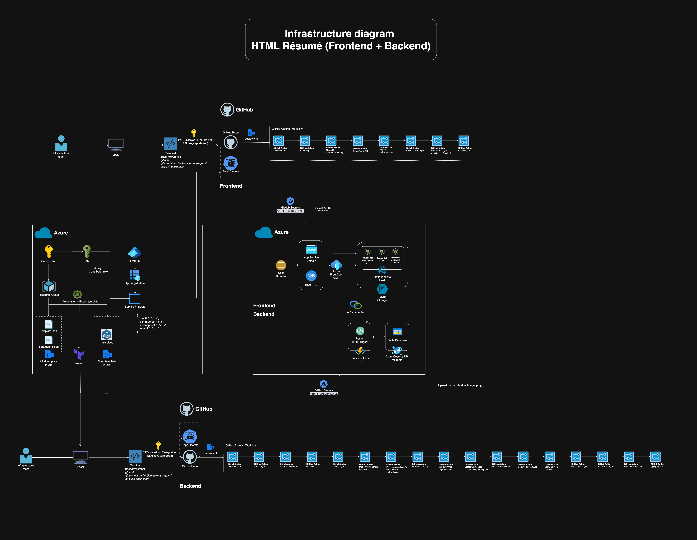

# 📝 Savio Ng – Interactive HTML Résumé (Frontend)

A single-page résumé (CV) published as a **static website** on Azure Storage and delivered globally via **Azure Front Door CDN**. Updates are deployed automatically from GitHub Actions.

| Live site | Tech stack | Deployment |
|-----------|------------|------------|
| [**https://mycv.saviong.com**](https://mycv.saviong.com) | HTML, CSS, Vanilla JS | Azure Static Website + CDN |

Please refer to <https://github.com/saviong/html-resume-backend> for the **Backend part** of the Interactive HTML Résumé.

---

## ✨ Feature Overview

| Feature | Description |
|---------|-------------|
| **Dark / Light theme** | Auto-detects system preference, manual toggle with ☀️/🌙 button, preference stored in `localStorage`. |
| **Live system clock** | JavaScript renders the user's local system time and updates every second. |
| **Visitor counter** | Calls serverless API (`updateCounter`) to increment & display total visits. |
| **Responsive design** | Pure CSS (Flexbox) — mobile-first, scales to desktop. |
| **Accessibility** | High-contrast colours, keyboard-navigable links, semantic headings. |
| **No frameworks** | Just HTML, CSS variables, and vanilla JS - easy to read & fork. |

---

## 🔧 Recent Updates

**August 2025:**
* **System Clock Update:** Modified the live clock feature to use the user's local system time instead of fetching from an external API. This change improves reliability and removes an external dependency.
* **Content Update:** Refreshed the company icon for Anthony Nolan to ensure it displays correctly.
* **Margin Update:** Updated margin setting including `padding`, `margin-bottom`, `line-height` for better printing layout.

---

## 🚀 Infrastructure diagram

  

